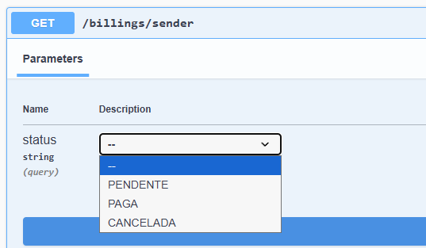
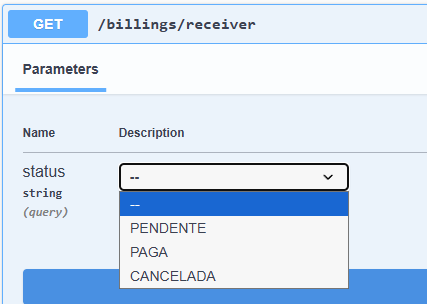
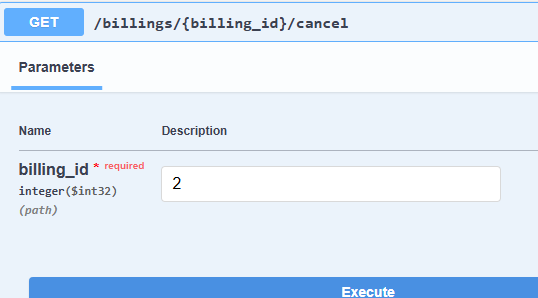

# Gateway de Pagamentos

Api desenvolvida em **Java 21** com **Spring Boot 3.5.6**, simulando um sistema de pagamentos com validação externa.

## Pré-requisitos

- Clone o repositório:

```bash
git clone https://github.com/Alhexx/application-taferas.git
```

## Configuração do Backend (Spring Boot)

### Comandos para a execução:

1. Configuração de um `.env`:

   - Crie um arquivo `.env` e preencha com:

     ```docker
       # Banco de dados
       SPRING_DATASOURCE_USERNAME=postgres
       SPRING_DATASOURCE_PASSWORD=postgres
       SPRING_DATASOURCE_URL=jdbc:postgresql://localhost:5432/paymentgateway

       # JWT
       SECURITY_JWT_SECRET=secret-de-testes-para-localhostt

       # URL externa
       EXTERNAL_PAYMENT_VALIDATOR_URL=https://zsy6tx7aql.execute-api.sa-east-1.amazonaws.com/authorizer
     ```

2. Execute o Docker compose para ter um container do postgres já configurado para a aplicação:

```bash
docker compose up -d --build
```

### Apos a inicialização do serviço:

- Acesse [http://localhost:8080/swagger-ui/index.html#/](http://localhost:8080/swagger-ui/index.html#/) para visualizar a documentação interativa das rotas.

## Sugestão de fluxo para testes

### 1 Criação de usuários:

- Pela rota `/users`
  - Recomendada a criação de no mínimo 2 usuários para testar todas as funcionalidades:

```json
{
  "name": "umberto",
  "email": "umberto@gmail.com",
  "cpf": "57994580017",
  "password": "teste123!"
}
```

```json
{
  "name": "doisberto",
  "email": "doisberto@gmail.com",
  "cpf": "57831242066",
  "password": "teste123!"
}
```

### 2 Login com doisberto:

- Pela rota `/auth`

```json
{
  "emailOrCpf": "57831242066",
  "password": "teste123!"
}
```

- Após o login clique no cadeado do swagger e copie o token retornado para lá

### 3 Deposito para doisberto

- Pela rota `/accounts/deposit`

```json
{
  "amount": 200.01
}
```

### 4 Login com umberto:

- Pela rota `/auth`

```json
{
  "emailOrCpf": "57994580017",
  "password": "teste123!"
}
```

- Após o login clique no cadeado do swagger e copie o token retornado para lá

### 5 Criação de cobranças:

- Pela rota `/billings`
  - Umberto vai criar uma cobrança para o Doisberto
  - Criar pelo menos 2

```json
{
  "value": 43.5,
  "receiverCPF": "57831242066",
  "description": "cobrança qualquer" # Detalhe obrigatório, ninguém paga algo sem saber o que é
}
```

```json
{
  "value": 150.5,
  "receiverCPF": "57831242066",
  "description": "cobrança qualquer" # Detalhe obrigatório, ninguém paga algo sem saber o que é
}
```

### 6 Listagem de cobranças

- Pela rota `/billings/sender`

  - Listagem de cobranças por criadas e seus status

  

- Pela rota /billings/receiver

  - Listagem de cobranças por recebidas e seus status

  

### 7 Pagamento de cobranças

- Pela rota `/billings/pay`

  - Pagamento por cartão

  ```json
  {
    "billingId": 1,
    "paymentMethod": "CARTAO",
    "cardNumber": "4111111111111111",
    "cvv": "123",
    "cardExpiryDate": "2027-05"
  }
  ```

  - Pagamento por saldo

  ```json
  {
    "billingId": 2,
    "paymentMethod": "SALDO"
  }
  ```

### 8 Cancelar pagamento

- Pela rota `/billings/{billing_id}/cancel`

  - Informe o ID da cobrança (tivemos uma com cartão e outra com saldo)

  

## Observações

- O fluxo é apenas uma sugestão e a api pode ser testada livremente

- Api consta com validação de CPF

- Api consta com tratamento de excções, experadas e inesperadas

- JWT implementado, token expirando 10 minutos, por padrão

- Arquitetura baseada em camadas inspirada em DDD

- Commits e escrita do código em inglês, mas erros todos em português
